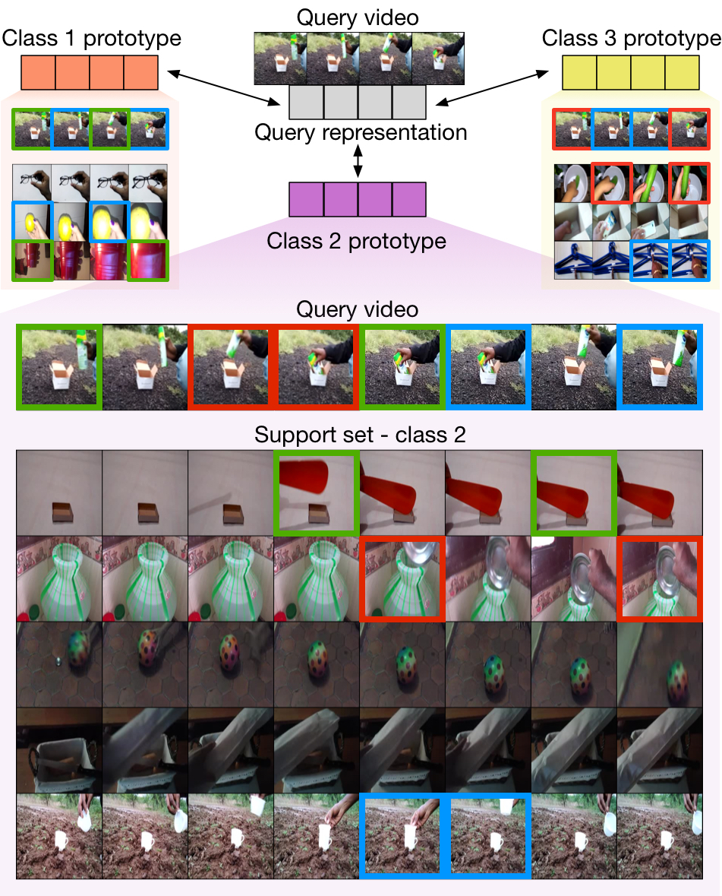

<p align="center" style="font-size:24px">
<a href="https://tobyperrett.github.io/">Toby Perrett</a> and <a href="https://dimadamen.github.io/">Dima Damen</a>
</p>

<p align="center">

</p>

## Abstract
...


## Video


<iframe align="center" width="640" height="360" src="https://www.youtube.com/embed/8MtC6X4w4jE" frameborder="0" allow="accelerometer; autoplay; encrypted-media; gyroscope; picture-in-picture" allowfullscreen></iframe>


## Paper

[PDF](main.pdf)

[ArXiv](https://arxiv.org/abs/2101.06184)

## Code

[GitHub](https://github.com/tobyperrett/trx)

## Bibtex

```markdown
@InProceedings{perrett21trx,
    author    = {Perrett, Toby and Masullo, Alessandro and Burghardt, Tilo and Mirmehdi, Majid and Damen, Dima},
    title     = {Temporal-Relational CrossTransformers for Few-Shot Action Recognition},
    booktitle = {The IEEE Conference on Computer Vision and Pattern Recognition (CVPR)},
    year      = {2021}
}
```

## Acknowledgements
This research is supported by EPSRC SPHERE Next Steps (EP/R005273/1). Damen is supported by EPSRC Fellowship UMPIRE~(EP/T004991/1).
